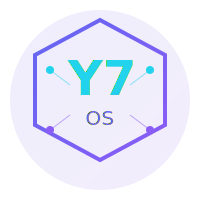

<p align="center">
  
</p>

<h1 align="center">Y7 OS</h1>

<p align="center">
  <strong>AI Stack for Linux — runs on any hardware</strong><br/>
  <em>مكدس الذكاء الاصطناعي للينكس — يعمل على أي جهاز</em>
</p>

<p align="center">
  <a href="https://github.com/yahyasaqban-lab/y7os/releases/latest"></a>
  <a href="LICENSE"></a>
  <a href="https://github.com/yahyasaqban-lab/y7os/stargazers"></a>
  <a href="https://y7os.dev"></a>
  <a href=".github/workflows/test-installer.yml"></a>
</p>

<p align="center">
  <a href="#quick-install">⚡ Quick Install</a> •
  <a href="#download">Download ISO</a> •
  <a href="#features">Features</a> •
  <a href="#quick-start">Quick Start</a> •
  <a href="#documentation">Docs</a> •
  <a href="#roadmap">Roadmap</a>
</p>

---

## ⚡ Quick Install (New! v0.1.0)

**Turn any Linux machine into an AI workstation in one command:**

```bash
curl -fsSL https://raw.githubusercontent.com/yahyasaqban-lab/y7os/main/tools/y7-install | sudo bash
```

Or download and run locally:
```bash
wget https://raw.githubusercontent.com/yahyasaqban-lab/y7os/main/tools/y7-install
chmod +x y7-install
sudo ./y7-install
```

### What the installer does:
- ✅ Auto-detects your hardware (RAM, CPU, GPU, device type)
- ✅ Picks the best AI backend — **Ollama** (8GB+) or **llama.cpp** (4-8GB)
- ✅ Installs Python, Docker, Open WebUI
- ✅ Sets up Y7 CLI tools
- ✅ Enables ZRAM compression for low-resource devices
- ✅ All in English **or Arabic** — auto-detects your language

### Options
```bash
sudo ./y7-install --lang ar              # Force Arabic
sudo ./y7-install --backend llama         # Force llama.cpp
sudo ./y7-install --dry-run --verbose     # Simulate first
sudo ./y7-install --skip-validation       # Skip post-install checks
```

**Compatible with:** Ubuntu 20.04+, Debian 11+, CentOS 8+, Raspberry Pi OS
**Minimum:** 4GB RAM, 20GB storage

> 📖 Full installer docs: [docs/INSTALLING.md](docs/INSTALLING.md)
> 🧪 Test suite: [tools/test-installer.sh](tools/test-installer.sh)
> 🔧 CI/CD: [.github/workflows/test-installer.yml](.github/workflows/test-installer.yml)

---

---

## What is Y7 OS?

Y7 OS is a **Linux distribution built for local AI**. It turns any computer — even old laptops with 4GB RAM — into a private AI workstation. No cloud. No subscriptions. No data leaving your device.

```
┌─────────────────────────────────────────────────────────────┐
│  Y7 OS v0.3.0                                               │
│                                                             │
│  ┌─────────────┐  ┌─────────────┐  ┌─────────────┐         │
│  │   Ollama    │  │  Open WebUI │  │   Docker    │         │
│  │  (LLMs)     │  │  (Chat UI)  │  │ (Containers)│         │
│  └─────────────┘  └─────────────┘  └─────────────┘         │
│                                                             │
│  ┌─────────────────────────────────────────────────┐       │
│  │  y7-ai │ y7-models │ y7-status │ y7-gpu │ y7-persist   │
│  └─────────────────────────────────────────────────┘       │
│                                                             │
│  ┌─────────────────────────────────────────────────┐       │
│  │       Debian Bookworm (AMD64 + ARM64)           │       │
│  └─────────────────────────────────────────────────┘       │
└─────────────────────────────────────────────────────────────┘
```

---

## Download

### Latest Release: v0.3.0

| Architecture | Download | Size | Use Case |
|--------------|----------|------|----------|
| **AMD64** | [y7os-0.3.0-amd64.iso](https://github.com/yahyasaqban-lab/y7os/releases/download/v0.3.0/y7os-0.3.0-amd64.iso) | ~1.5 GB | Intel/AMD PCs, laptops |
| **ARM64** | [y7os-0.3.0-arm64.iso](https://github.com/yahyasaqban-lab/y7os/releases/download/v0.3.0/y7os-0.3.0-arm64.iso) | ~1.5 GB | Raspberry Pi 4/5, Pine64 |

**Checksums:** [AMD64](https://github.com/yahyasaqban-lab/y7os/releases/download/v0.3.0/y7os-0.3.0-amd64.iso.sha256) | [ARM64](https://github.com/yahyasaqban-lab/y7os/releases/download/v0.3.0/y7os-0.3.0-arm64.iso.sha256)

### What's New in v0.3.0
- **ARM64 support** — Raspberry Pi 4/5, Apple Silicon (via UTM)
- **NVIDIA GPU detection** — `y7-gpu detect` and driver installation
- **Persistence mode** — Save data across reboots with `y7-persist`
- **TinyLlama bundled** — Works offline immediately!

### Flash to USB

```bash
# Linux/macOS
sudo dd if=y7os-0.3.0-amd64.iso of=/dev/sdX bs=4M status=progress

# Or use Balena Etcher, Rufus, Ventoy
```

---

## Features

### Pre-installed AI Stack
- **Ollama** — Run LLMs locally (Llama, Mistral, Qwen, Phi)
- **TinyLlama bundled** — Works offline, no download needed!
- **Open WebUI** — ChatGPT-like interface at `localhost:3000`
- **Docker** — Container runtime for AI tools
- **NVIDIA GPU support** — Auto-detection and easy driver install
- **y7 Tools** — CLI tools for AI management

### Optimized for Low Resources
- **4GB RAM minimum** — runs on old laptops
- **ZRAM enabled** — compressed swap for better performance
- **Auto model selection** — picks the best model for your RAM

### Privacy First
- **100% local** — no data leaves your device
- **No accounts required** — no sign-ups, no tracking
- **Offline capable** — works without internet after setup

### Arabic + English Native
- **Full Arabic support** — RTL, locales, keyboard
- **Bilingual tools** — `y7-ai --lang ar`

---

## Quick Start

### 1. Boot & Login
```
Username: y7
Password: y7
```

### 2. Start Chatting
```bash
y7-ai                      # Interactive chat
y7-ai "explain kubernetes" # Single question
```

### 3. Open Web UI
```
http://localhost:3000
```

### 4. Manage Models
```bash
y7-models list            # Show downloaded models
y7-models recommend       # Best model for your RAM
y7-models download phi3   # Download a model
```

### 5. System Status
```bash
y7-status                 # Dashboard
y7-bench                  # Benchmark your system
```

---

## System Requirements

| Spec | Minimum | Recommended |
|------|---------|-------------|
| **RAM** | 4 GB | 8 GB+ |
| **Storage** | 20 GB | 50 GB+ |
| **CPU** | 64-bit x86 | 4+ cores |
| **Internet** | Required for first boot | Optional after setup |

### Model RAM Guide

| Model | RAM Required | Quality |
|-------|--------------|---------|
| TinyLlama | 2 GB | Basic |
| Phi-3 Mini | 4 GB | Good |
| Qwen 2.5 7B | 6 GB | Great (Arabic) |
| Llama 3.1 8B | 8 GB | Best |

---

## Documentation

- [Installation Guide](docs/guides/installation.md)
- [Getting Started](docs/guides/getting-started.md)
- [Model Guide](docs/models.md)
- [CLI Reference](docs/guides/cli-reference.md)
- [Architecture](docs/architecture.md)
- [FAQ](docs/guides/faq.md)

---

## Roadmap

### v0.3.0 — Q2 2026
- [ ] ARM64 support (Raspberry Pi, Apple Silicon)
- [ ] GPU acceleration (NVIDIA, AMD)
- [ ] Persistence mode for live USB
- [ ] Auto-update system

### v0.4.0 — Q3 2026
- [ ] Fine-tuning tools (Unsloth, Axolotl)
- [ ] RAG pipeline (ChromaDB, LlamaIndex)
- [ ] Voice interface (Whisper, TTS)
- [ ] Mobile companion app

### v1.0.0 — Q4 2026
- [ ] Stable release
- [ ] Enterprise support
- [ ] Certified hardware partners

See [ROADMAP.md](ROADMAP.md) for details.

---

## العربية

### التحميل

قم بتحميل ملف ISO من [صفحة الإصدارات](https://github.com/yahyasaqban-lab/y7os/releases/latest)

### البدء السريع

```bash
# تسجيل الدخول
المستخدم: y7
كلمة المرور: y7

# محادثة بالعربية
y7-ai --lang ar

# لوحة الحالة
y7-status --lang ar

# أفضل نموذج لجهازك
y7-models recommend
```

### النماذج المدعومة للعربية

| النموذج | الذاكرة | جودة العربية |
|---------|---------|--------------|
| qwen2.5:7b | 6 GB | ممتازة |
| llama3.1:8b | 8 GB | جيدة جداً |
| phi3:mini | 4 GB | جيدة |

---

## Contributing

We welcome contributions! See [CONTRIBUTING.md](CONTRIBUTING.md).

```bash
git clone https://github.com/yahyasaqban-lab/y7os.git
cd y7os
make build
```

---

## Community

- **Website:** [y7os.dev](https://y7os.dev)
- **GitHub:** [github.com/yahyasaqban-lab/y7os](https://github.com/yahyasaqban-lab/y7os)
- **Twitter/X:** [@y7os_ai](https://twitter.com/y7os_ai)

---

## License

MIT License — free forever. See [LICENSE](LICENSE).

---

<p align="center">
  <strong>Built by <a href="https://github.com/yahyasaqban">Yahya Saqban</a> — Kuwait 🇰🇼</strong><br/>
  <em>For everyone who deserves access to AI</em>
</p>

<p align="center">
  🧠 <strong>AI Contributors:</strong> DeepSeek AI • Claude (Anthropic)
</p>
